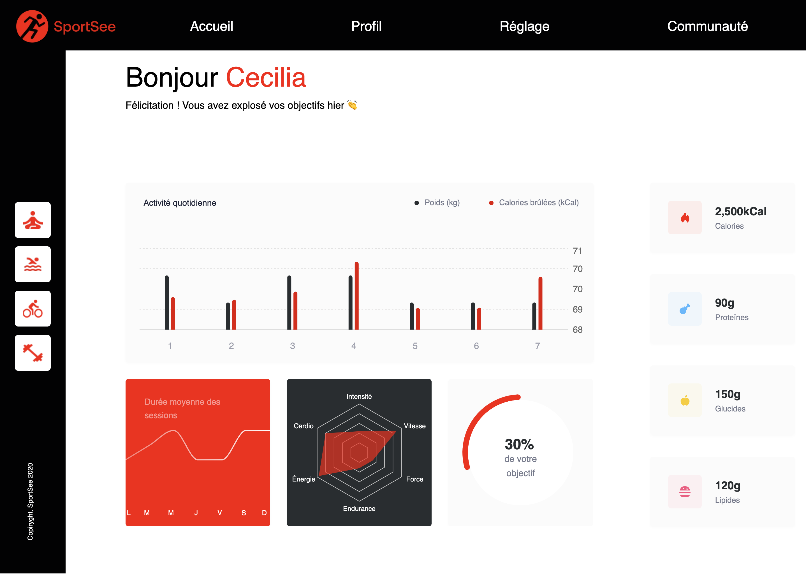

This is a [Next.js](https://nextjs.org/) project bootstrapped with [`create-next-app`](https://github.com/vercel/next.js/tree/canary/packages/create-next-app).

## Getting Started

First, run the development server:

```bash
npm run dev
# or
yarn dev
# or
pnpm dev
```

Open [http://localhost:3001](http://localhost:3001) with your browser to see the result.

You can start editing the page by modifying `index.js`. The page auto-updates as you edit the file.

This project uses [`next/font`](https://nextjs.org/docs/basic-features/font-optimization) to automatically optimize and load Inter, a custom Google Font.

## Learn More

To learn more about Next.js, take a look at the following resources:

- [Next.js Documentation](https://nextjs.org/docs) - learn about Next.js features and API.
- [Learn Next.js](https://nextjs.org/learn) - an interactive Next.js tutorial.

You can check out [the Next.js GitHub repository](https://github.com/vercel/next.js/) - your feedback and contributions are welcome!

## Deploy on Vercel

The easiest way to deploy your Next.js app is to use the [Vercel Platform](https://vercel.com/new?utm_medium=default-template&filter=next.js&utm_source=create-next-app&utm_campaign=create-next-app-readme) from the creators of Next.js.

Check out our [Next.js deployment documentation](https://nextjs.org/docs/deployment) for more details.

SPORTSEE

Project Structure
The project contains the following main folders and files:

components: This contains all the reusable components used in the project.
models: This contains model classes used for managing data within the project.
styles: This contains all CSS style files for the project.
data: This contains mock data.

Components
Title
DailyActivity
ASDuration (Average Session Duration)
Intensity
Score
Energies
Each component is designed to be reusable and can be easily incorporated into other parts of the application.

Models
We use the following models for managing data:

User
Performance
AverageSessions
Activity

Our home page is composed of several sections that display user data.

Title: Displays the page title.
DailyActivity: Shows the user's daily activity.
ASDuration: Shows the user's average session duration.
Intensity: Shows the user's session intensity.
Score: Displays the user's score.
Energies: Displays the user's energy levels.
Project Image

Running the Project
To run this project, you will need Node.js and npm installed on your machine. You can then clone this repository and run npm install to install all dependencies.

To start the application in development mode, you can run npm run dev and open http://localhost:3000 to see the application in action.
